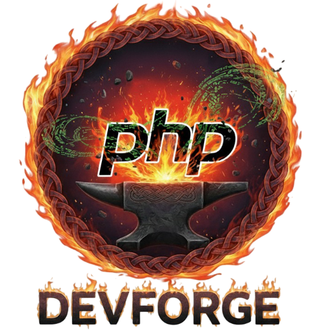

<p align="center">
  
</p>

# PHP DevForge

[](LICENSE) []()

A ready-to-use PHP development environment powered by Docker containers that provides automatic domain generation, local SSL certificates, and live code editing capabilities.

## 📖 Description

PHP DevForge is a comprehensive Docker-based development environment designed to streamline PHP development. It features:

- **Automatic Domain Generation**: Create local domains without manual configuration
- **Local SSL Certificates**: Auto-generated certificates with mkcert for secure HTTPS development
- **PHP Version Switching**: Switch between PHP versions via URL parameters
- **Live Code Editing**: Shared volumes allow real-time code changes
- **Multi-Container Setup**: Apache, PHP-FPM, DNS, and optional database services

The environment automatically generates URLs based on your project folder structure. For example, a project at `laravel/site/public/index.php` becomes accessible at `https://public--site--laravel.phpforge.dev`.

## 🔧 Installation

### 📋 Prerequisites

- Docker and Docker Compose
- Git
- Bash shell (Linux/macOS)

### 🚀 Setup Steps

1. **Clone the repository:**
   ```bash
   git clone git@github.com:zelti/php-devforge.git $HOME/php-devforge-config
   cd $HOME/php-devforge-config
   ```
    It’s recommended to clone the project inside your home directory.
    This ensures the provided bash alias will work correctly.

2. **Configure environment variables:**
   Edit the `.env` file to customize:
   - `DEV_DOMAIN`: Your development domain (default: phpforge.dev)
   - `PHP_VERSION`: Default PHP version (83 for 8.3, 84 for 8.4)
   - `USERNAME`: Your system username

3. **Install SSL certificates:**
   ```bash
   ./install_cert.sh
   ```
   This script:
   - Installs mkcert if not present
   - Generates wildcard SSL certificates for `*.phpforge.dev`
   - Installs the local Certificate Authority (CA) in your system trust store

4. **Setup local DNS:**
   ```bash
   ./setup-local-dns.sh
   ```
   This configures your system to resolve `*.phpforge.dev` domains to `127.0.0.1`.

5. **Source the aliases (optional but recommended):**
    ```bash
    source aliases.bash
    ```
    Or add the following to your `~/.bashrc` for permanent availability:
    ```bash
    source $HOME/php-devforge-config/aliases.bash
    ```

6. **Start the containers:**
    ```bash
    docker-compose up -d
    ```
    (If you sourced the aliases, you can use `forge:start` instead)

## 💻 Usage

### ▶️ Starting and Stopping

```bash
# Start all services
forge:start

# Stop all services
forge:stop

# Reload services
forge:reload

# Check current PHP version
forge:current

# Switch to PHP 8.3
forge:use:php83

# Switch to PHP 8.4
forge:use:php84

# Access PHP 8.3 container
forge:exec:php83

# Access PHP 8.4 container
forge:exec:php84

# View PHP 8.3 logs
forge:logs:php83

# View PHP 8.4 logs
forge:logs:php84
```

### 🌐 Accessing Your Projects

1. **Create project structure:**
   Place your PHP projects in `/home/php-devforge/public_html/` 
   it will create this folder on your local you will need to change the folder user and group manually for first time
   ```
    sudo chown yourUser:www-data -R /home/php-devforge
    ```

2. **URL Structure:**
   Projects are accessible via automatically generated URLs:
   - `folder/project/public/index.php` → `https://public--project--folder.phpforge.dev`
   - The URL is constructed by reversing the folder path segments separated by `--`

3. **PHP Version Switching:**
   Append `--p83` or `--p84` to the URL to use specific PHP versions:
   - `https://public--project--folder.phpforge.dev` (uses default PHP version)
   - `https://public--project--folder--p83.phpforge.dev` (forces PHP 8.3)
   - `https://public--project--folder--p84.phpforge.dev` (forces PHP 8.4)

### 🔄 Development Workflow

- Edit code in your IDE (files are volume-mounted for live updates)
- Changes appear immediately without restarting containers
- Use Xdebug for debugging (configure your IDE for port 9000)
- Access PHP containers via `forge:exec:php84` (or `forge:exec:php83` for PHP 8.3)

## 🛠️ Supported PHP Extensions and Tools

### 📦 PHP Extensions
- **Core Extensions**: GD, Intl, Zip, PDO MySQL, PDO PostgreSQL, SOAP, XSL, BC Math, OPcache, Mbstring, Exif, PCNTL
- **PECL Extensions**: Imagick, Redis, APCu, Xdebug

### 🔨 Development Tools
- **Composer**: PHP dependency manager (pre-installed)
- **Node.js 19**: Via NVM (Node Version Manager)
- **Git**: Version control
- **Xdebug**: PHP debugging extension
- **Cron**: Task scheduling support

### 🐳 Container Features
- **User Setup**: devuser with sudo privileges
- **Volume Sharing**: Live code editing
- **FPM Configuration**: Optimized for development
- **Error Display**: PHP errors shown in development mode

## 📁 Recommended Project Organization

Create a dedicated folder inside public_html that will contain a symbolic link for each project.
Each symbolic link should point to the project’s public folder (where index.php is located).

```
~/sites/
├── laravel-app   → symbolic link to Laravel’s /public folder
├── symfony-app   → symbolic link to Symfony’s /public folder
└── plain-php     → symbolic link to the folder containing 
```

This setup keeps your project URLs clean. For example:

Laravel app → `laravel-app--site.phpforge.dev`

Symfony app → `symfony-app--site.phpforge.dev`

Plain PHP app → `plain-php--site.phpforge.dev`

### Example: Creating a symbolic link
#### Example for a Laravel project
`ln -s /public_html/projects/laravel-app/public ~/sites/laravel-app`

#### Example for a Symfony project
`ln -s /public_html/projects/symfony-app/public ~/sites/symfony-app`

#### Example for a plain PHP project
`ln -s /public_html/projects/plain-php ~/sites/plain-php`

## 🐛 Troubleshooting

### ❓ Common Issues

- **DNS resolution not working**: Ensure you ran `./setup-local-dns.sh` and restarted your browser or system. You may need to flush DNS cache.
- **SSL certificate not trusted**: Make sure you ran `./install_cert.sh` and the CA is installed in your system's trust store. Restart your browser after installing.
- **Containers not starting**: Check that Docker and Docker Compose are installed and running. Ensure ports 80 and 443 are not in use by other services.
- **Permission issues with public_html**: Run `sudo chown yourUser:www-data -R /home/php-devforge` to set correct ownership.
- **PHP version not switching**: Use the aliases `forge:use:php83` or `forge:use:php84` to change the default version, or append `--p83`/`--p84` to the URL.
- **Aliases not working**: Ensure you sourced `aliases.bash` or added it to your `~/.bashrc`.

For more help, check the logs with `docker-compose logs` or create an issue on GitHub.

## 🤝 Contributing

We welcome contributions to improve PHP DevForge! Please follow these guidelines:

### ⚙️ Development Setup
1. Fork the repository
2. Create a feature branch: `git checkout -b feature/your-feature`
3. Make your changes
4. Test thoroughly with different PHP versions and configurations
5. Update documentation if needed

### 📏 Code Standards
- Follow Docker best practices
- Use clear, descriptive commit messages
- Test configurations on multiple platforms (Linux, macOS)
- Ensure backward compatibility

### 🧪 Testing
- Test SSL certificate generation
- Verify DNS resolution works
- Check PHP version switching
- Validate volume mounting and live editing
- Test with different project structures

### 📚 Documentation
- Update README for new features
- Document configuration options
- Provide examples for common use cases
- Keep installation instructions current

### 📤 Submitting Changes
1. Ensure all tests pass
2. Update CHANGELOG.md if applicable
3. Submit a pull request with detailed description
4. Address review feedback promptly

### 🐛 Reporting Issues
- Use GitHub issues for bug reports
- Include your OS, Docker version, and PHP version
- Provide steps to reproduce
- Attach relevant logs and configuration files

## 📄 License

This project is licensed under the MIT License - see the [LICENSE](LICENSE) file for details.

## 💬 Support

For questions or issues:
- Check the troubleshooting section in documentation
- Search existing GitHub issues
- Create a new issue with detailed information
